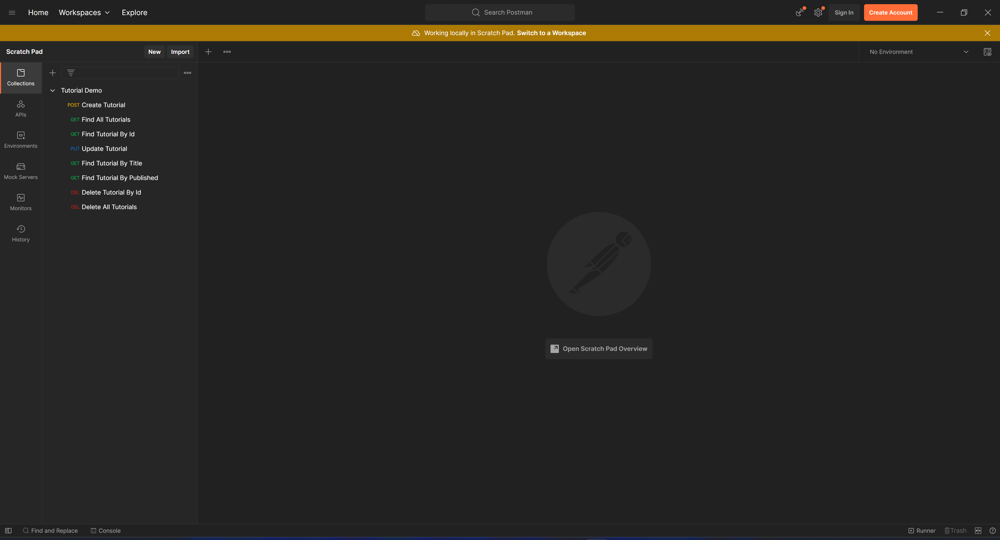
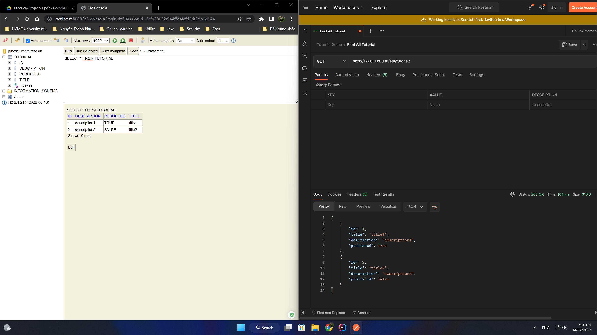
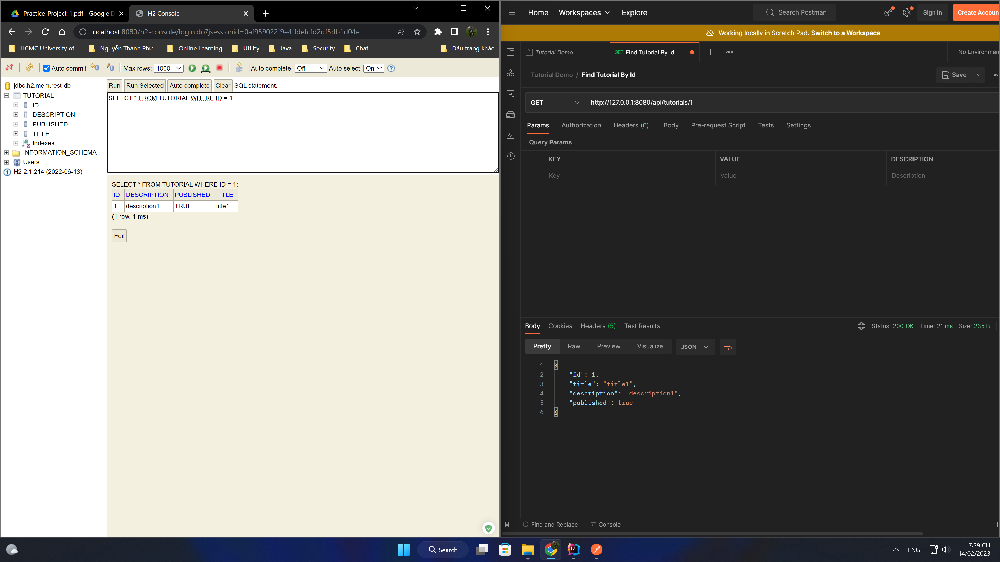
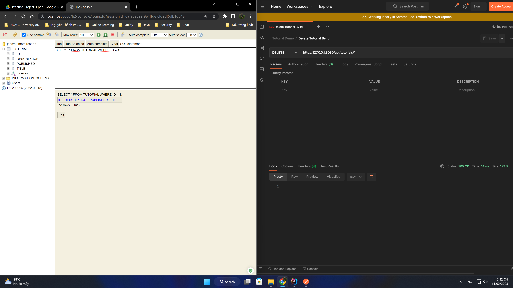
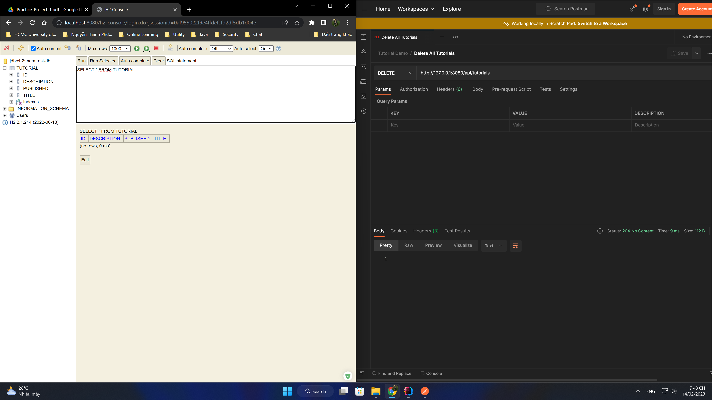
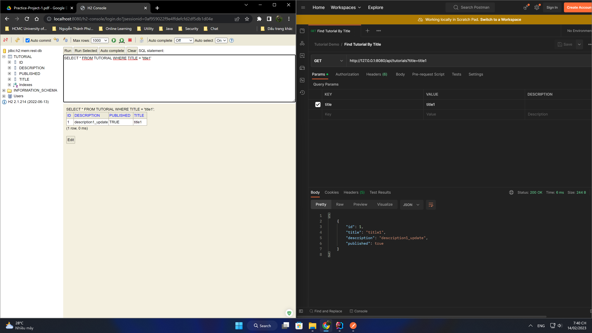

# Demo Restful CRUD API Spring Boot Application
## Overview
- **Technical**: **Spring Boot 2.7.8**
  - [Spring Web](https://docs.spring.io/spring-boot/docs/2.7.8/reference/htmlsingle/#web)
  - [Spring Data JPA](https://docs.spring.io/spring-boot/docs/2.7.8/reference/htmlsingle/#data.sql.jpa-and-spring-data)
- **SQL**
  - [H2 Database](https://www.h2database.com/html/main.html)
- **Tool**
  - [Lombok](https://projectlombok.org/)
## Structure of application
<pre>
├── <b>src</b>
│   ├── <b>main</b>
│   │   ├── <b>java</b>
│   │   │   ├── <b>com.likelion.rest</b>
│   │   │   │   └── controller
│   │   │   │   └── entity
│   │   │   │   └── repository
│   │   │   │   └── service
│   ├── <b>resources</b>
│   ├── <b>test</b>
├── ...
</pre>
## API Collection

- Create Tutorial: [POST /api/tutorials](#api-1)
- Find All Tutorials: [GET /api/tutorials](#api-2)
- Find Tutorial By Id: [GET /api/tutorials/{id}](#api-3)
- Update Tutorial: [PUT: /api/tutorials/{id}](#api-4)
- Delete Tutorial By Id: [DELETE: /api/tutorials/{id}](#api-5)
- Delete All Tutorials: [DELETE: /api/tutorials](#api-6)
- Find Tutorial By Published: [GET: /api/tutorials/published](#api-7)
- Find Tutorial By Title: [GET: /api/tutorials?title={title}]](#api-8)

## Results
### 1. API Create Tutorial
#### POST /api/tutorials

### 2. API Find All Tutorials
#### GET /api/tutorials

### 3. API Find Tutorial By Id
#### GET /api/tutorials/{id}

### 4. API Update Tutorial
#### PUT: /api/tutorials/{id}

### 5. API Delete Tutorial By Id
#### DELETE: /api/tutorials/{id}

### 6. API Delete All Tutorials
#### DELETE: /api/tutorials

### 7. API Find Tutorial By Published
#### GET: /api/tutorials/published

### 8. Find Tutorial By Title
#### GET: /api/tutorials?title={title}

### 9. Click [json postman collection file](result/tutorial_demo.postman_collection.json) to see